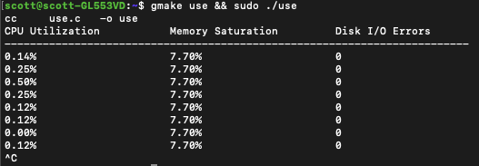
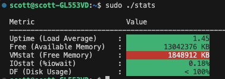

# o11y
Observability toolkit for Linux — CPU utilization, memory saturation, disk/network I/O errors, process inspection, scheduler latency, and heap profiling.

Implements the [USE method](https://www.brendangregg.com/usemethod.html) (Utilization, Saturation, Errors) and extends it with a full suite of complementary tools.

---

## Tools

| Binary | Description |
|---|---|
| `use` | CPU utilization, memory saturation, disk I/O errors — live, 1 s refresh |
| `stats` | System stats dashboard with color-coded thresholds |
| `sys_stats` | CPU operation speed benchmark (ns/op for int, float, trig) |
| `netwatch` | Per-interface RX/TX MB/s, kpps, errors, TCP retransmit rate |
| `procwatch` | Top N processes by CPU% or RSS — live, 1 s refresh |
| `netlatency` | ICMP ping with min/avg/max/p99 latency and packet loss |
| `fdwatch` | File descriptor usage per process + system totals |
| `schedlag` | Scheduler wakeup latency distribution with ASCII histogram |
| `heaptrack` | Wrap any command to report malloc/free rate and live heap size |

---

## Build (native)

```
make all
```

Requires `gcc`, `make`, and standard C libraries. `schedlag` links `-lm -lrt`; `heaptrack_inject.so` links `-ldl -lpthread`.

---

## Usage examples

```bash
# USE method monitor
./use

# Top 20 processes sorted by memory, refresh every 2 s
./procwatch -m -n 20 -i 2

# Ping google.com 50 times, 200 ms between packets
sudo ./netlatency google.com 50 200

# Watch file descriptor pressure (top 10, hide procs with < 5 fds)
./fdwatch -n 10 -t 5

# Measure scheduler latency for 30 seconds
./schedlag 30

# Profile malloc activity of a command
./heaptrack ./my_server --config /etc/my_server.conf
```

---

## `use` command output



## `stats` command output



---

## Docker

### Build the image

```bash
docker build -t o11y:latest .
```

### Run locally with Docker

The container mounts the host's `/proc` and `/sys` so the tools see
node-level metrics rather than container-scoped ones.

```bash
docker run -it --rm \
  --pid=host \
  --network=host \
  --cap-add=NET_RAW \
  --cap-add=SYS_PTRACE \
  -v /proc:/proc:ro \
  -v /sys:/sys:ro \
  o11y:latest \
  /o11y/use
```

Swap `/o11y/use` for any other tool, e.g. `/o11y/procwatch -n 20`.

> `netlatency` requires `--cap-add=NET_RAW` (raw ICMP sockets).
> `procwatch` and `fdwatch` require `--pid=host` to see all node processes.

---

## Kubernetes

The DaemonSet in `k8s/daemonset.yaml` deploys o11y to **every node** in
the cluster. It mounts the host `/proc` and `/sys`, enables `hostPID`
and `hostNetwork`, and adds the capabilities the tools need.

### 1 — Build the image

```bash
docker build -t o11y:latest .
```

### 2 — Load the image into your local cluster

**Docker Desktop (built-in Kubernetes)**

No extra step needed — Docker Desktop Kubernetes shares the Docker image cache.

**kind**

```bash
kind load docker-image o11y:latest
```

**minikube**

```bash
minikube image load o11y:latest
```

### 3 — Deploy the DaemonSet

```bash
kubectl apply -f k8s/daemonset.yaml
```

Verify the pod is running:

```bash
kubectl get pods -n monitoring -l app=o11y
```

### 4 — Exec into a pod and run tools

Get the pod name:

```bash
POD=$(kubectl get pod -n monitoring -l app=o11y -o jsonpath='{.items[0].metadata.name}')
```

Then exec in and run any tool:

```bash
# USE method monitor
kubectl exec -it -n monitoring $POD -- use

# Top 20 processes by CPU
kubectl exec -it -n monitoring $POD -- procwatch -n 20

# File descriptor pressure
kubectl exec -it -n monitoring $POD -- fdwatch -n 15

# Network throughput per interface
kubectl exec -it -n monitoring $POD -- netwatch

# Scheduler latency for 10 seconds
kubectl exec -it -n monitoring $POD -- schedlag 10

# Network round-trip latency
kubectl exec -it -n monitoring $POD -- netlatency 8.8.8.8 20
```

Or drop into a shell:

```bash
kubectl exec -it -n monitoring $POD -- /bin/bash
```

### 5 — Tear down

```bash
kubectl delete -f k8s/daemonset.yaml
```

---

## Notes

- All tools read from `/proc` and `/sys` — they are **Linux-only**.
- `netlatency` requires `CAP_NET_RAW` (raw ICMP). The DaemonSet grants this.
- `heaptrack` uses `LD_PRELOAD`; `heaptrack_inject.so` must live alongside the `heaptrack` binary (both are in `/o11y/` in the container).
- The DaemonSet runs as `root` (uid 0) so tools can read `/proc/<pid>/fd` for arbitrary processes. Scope access with RBAC or namespace selectors as appropriate for your environment.
